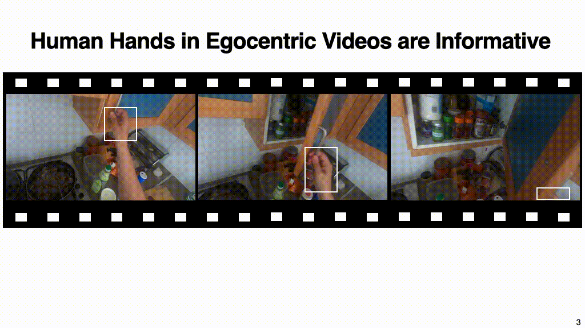

# Human Hands as Probes for Interactive Object Understanding

### CVPR 2022
[Mohit Goyal](https://mohit1997.github.io/), [Sahil Modi](https://www.linkedin.com/in/sahil-modi/), [Rishabh Goyal](https://www.linkedin.com/in/rishgoyell/), [Saurabh Gupta](http://saurabhg.web.illinois.edu) <br/>
University of Illinois at Urbana-Champaign<br/>

[\[Project Page\]](https://s-gupta.github.io/hands-as-probes/index.html) [\[Arxiv\]](https://arxiv.org/pdf/2112.09120.pdf)

<strong>Abstract:</strong> Interactive object understanding, or what we can do to objects and how is a long-standing goal of computer vision. In this paper, we tackle this problem through observation of human hands in in-the-wild egocentric videos. We demonstrate that observation of what human hands interact with and how can provide both the relevant data and the necessary supervision. Attending to hands, readily localizes and stabilizes active objects for learning and reveals places where interactions with objects occur. Analyzing the hands shows what we can do to objects and how. We apply these basic principles on the EPIC-KITCHENS dataset, and successfully learn state-sensitive features, and object affordances (regions of interaction and afforded grasps), purely by observing hands in egocentric videos.

## Motivation



## Prerequisites

Anaconda or miniconda is required for setting up the environment to train the models. You would also need to download EPIC-KITCHENS dataset available [here](https://github.com/epic-kitchens/epic-kitchens-download-scripts) and the [hand-object bboxes](https://github.com/epic-kitchens/epic-kitchens-100-annotations#automatic-annotations-download).

```bash
conda env create --file environment.yml
conda activate humanhands
```

## Learning State-Sensitive Features

### [Pretraining](./learning-state-features/)
Please follow the link above to reproduce the pretraining of the state-sensitive features model.

### [Evaluation on EPIC-STATES](./evaluation/epic-states)
This contains the EPIC-STATES dataset and evaluation code to benchmark the pretrained model.

## Learning Object Affordances

### [Training ACP](./ACP/)
Please follow above link to retrain ACP (affordances by context prediction) models.

### [Evaluating ROI Predictions](./evaluation/epic-roi)
This contains the EPIC-ROI dataset and evaluation code to benchmark the pretrained model.

### [Evaluating Grasps afforded by objects](./evaluation/GAO)
This contains the GAO Benchmark and evaluation code to benchmark the pretrained model.

## Citing

If you find this work and/or dataset useful in your research, please cite:

```
@inproceedings{goyal2022human,
      title={Human Hands as Probes for Interactive Object Understanding}, 
      author={Mohit Goyal and Sahil Modi and Rishabh Goyal and Saurabh Gupta},
      year={2022},
      booktitle = {Computer Vision and Pattern Recognition (CVPR)}
}
```
