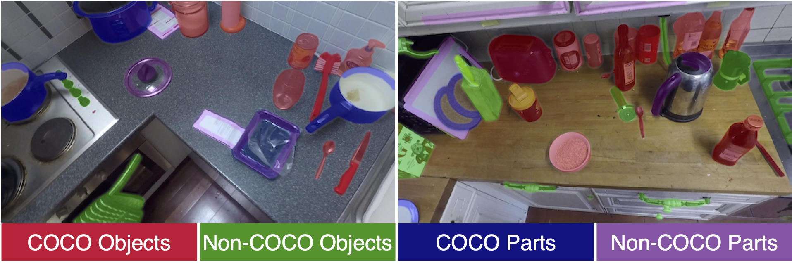

# EPIC-ROI



## Annotation Instructions

We provide the annotation instructions used for labelling EPIC-ROI dataset [here](./doc/EPIC-ROI.pdf).

## Extracting high res frames


The following script will extract frames in the `PATH_TO_EPIC_VIDEOS` where [EPIC-KITCHENS videos](https://github.com/epic-kitchens/epic-kitchens-download-scripts) are downloaded.
```bash
python extract_highresframes.py --data PATH_TO_EPIC_VIDEOS
```

## Sampling EPIC-ROI frames

```bash 
python get_epicframes.py --data PATH_TO_EPIC_VIDEOS --out_dir data/roi-data/images
```

## Evaluation

1. Add your model predictions to `configs/methods.yaml` as follows:
```python
'Your Method':
      path: PATH_TO_PREDICTIONS
      blurring: False # Can be True or False
      bradius: 25 # Blurring Radius
      eval_with_MaskRCNN: True # Evaluate after combination with MaskRCNN
      MaskRCNN_weight: 2 # The weight for MaskRCNN
```
2. Evaluate the predictions using
```bash
python evaluate.py --cat all --split val/test --config configs/methods.yaml
```

3. Tabulate and save metrics to csv (`benchmark_results/benchmark_test.csv`)
```bash
python combine_results.py --split val/test --inp_dir results/methods --verbose
```


## MaskRCNN baseline

For MaskRCNN baseline, we used [detectron2 @ df6eac1814](https://github.com/facebookresearch/detectron2/tree/df6eac1814e7182625640d9168e4308bd3a6a8f8). The pretrained model followed a  ResNet-101 FPN style network, and is available at the Detectron 2 Model Zoo with model id `138205316`. 

