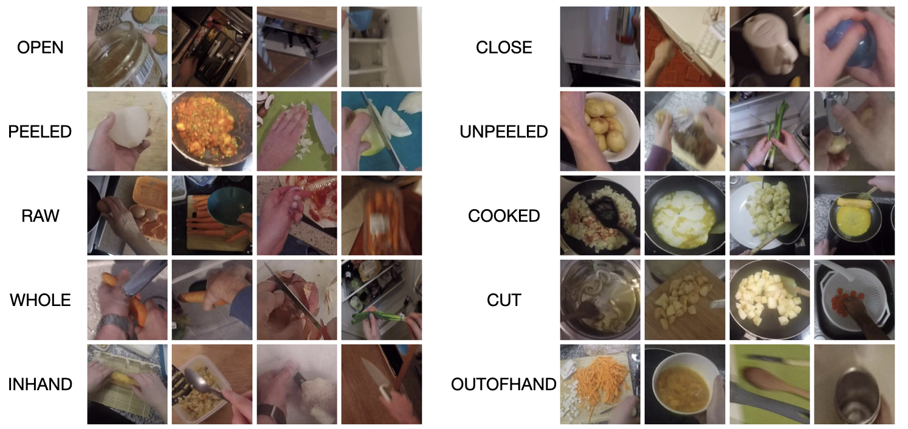

# EPIC-STATES



## Annotation Instructions

The annotations instructions for individual object are available [here](./doc/).

## Dataset Images and Annotations

The annotations were collected using a commercial service [Scale AI](https://scale.com). The collected and processed annotations are available [here](./data/epic-states-annotations.csv)

To extract the images, download the [EPIC-KITCHEN object detection images](https://github.com/epic-kitchens/epic-kitchens-download-scripts) using the flag `--object-detection-images`.

We provied a script to then extract the crops that were annotations. To extract the crops, run the following commands:

```bash
python extract_epicstates_json.py --data PATH_TO_EPIC_KITCHEN_IMAGES
```


## Evaluation

### Run a single configuration
Please supply the path to the pretrained `path/to/checkpoint_200.pth` checkpoint (except for MIT-States/Action for which we evaluate the `/path/to/checkpoint_best.pth`).

```
# To run on all state classes
python evaluate.py \
    --percent 100 \
    --log out/eval \
    --gpu 0 \
    --model_path <path to pretrained .pth file> \
    --data_dir <path to epic states dataset>

# To run novel classes only
python evaluate.py \
    --percent 100 \
    --log out/eval \
    --novel \
    --gpu 0 \
    --model_path <path to pretrained .pth file> \
    --data_dir <path to epic states dataset>
```

### Run multiple configurations in parallel
We have included a script that will automatically run `evaluate.py` in parallel with different dataset sizes (`percent`) across multiple GPUs. Note: this assumes three models were pretrained with seeds 0, 100, and 417, and please only supply the path for any _one_ of the provided seeds to `--model_path`. Use this command to reproduce mAP numbers reported in the paper.
```
python run_evaluation_parallel.py \
    --gpu 0,0,1,1 \
    --percent 100,12.5 \
    --model_path <path to pretrained *.pth file> \
    --output_dir out/eval \
    --data_dir <path to epic states dataset> \
    --seeds 0,100,417 \
    --and_novel
```

### Create CSV with results
```
# For all classes
python json_to_csv.py -d out/eval --split [test, validation]

# For novel classes
python json_to_csv.py -d out/eval_novel --split [test, validation]
```

Please see the `out/eval{_novel}/results/<split>_final_aggseeds.csv` for the results. The mAP results in the CSV for 100% training data and all classes should match the mAP in the table provided in [the pretraining README](../../learning-state-features/). This CSV along with the novel version should correspond with the mAP numbers reported in the paper.